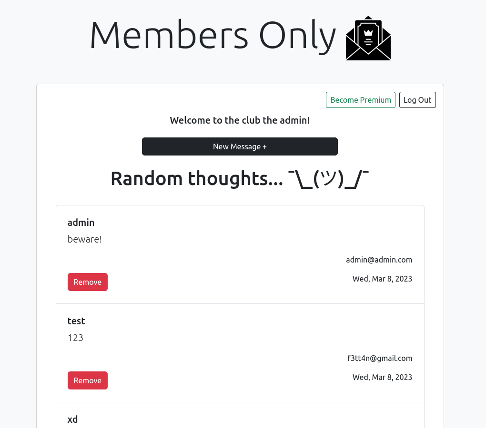

# Members Only

Members Only app created with **Express**, **Bootstrap** and **mongoDB**.

⮕ [Live preview](https://express-members-only.cyclic.app/)

Secret key for premium status: **theodinproject**

## Features

-   CRUD operations on mongoDB database with admin authorization.
-   User and admin model.
-   Register/Login/Logout with safe methods.
-   Premium user privilages like seeing comments belongs to whom.
-   Custom 404 and errors page.

## Helper Dependencies

-   [EJS](https://ejs.co/) template view engine
-   [Passport.js](https://www.passportjs.org/) for authorization
-   [Mongoose](https://mongoosejs.com/) for mongoDB
-   [bcryptjs](https://www.npmjs.com/package/bcryptjs) for hashing passwords
-   [express-validator](https://express-validator.github.io/docs) for validating and sanitizing functions
-   [method-override](https://www.npmjs.com/package/method-override) for using HTTP methods in places where the client doesn't support it
-   [express-ejs-layouts](https://www.npmjs.com/package/express-ejs-layouts) for layouts in EJS
-   [express-rate-limit](https://www.npmjs.com/package/express-rate-limit) for limiting the requests per defined time
-   [dotenv](https://www.npmjs.com/package/dotenv) for processing .env files
-   [serve-favicon](https://www.npmjs.com/package/serve-favicon) for serving favicon in servers
-   [nodemon](https://nodemon.io/) for monitoring any changes and automatically restarting server
-   [cors](https://www.npmjs.com/package/helmet) for enabling CORS with defined options
-   [helmet](https://www.npmjs.com/package/helmet) for security

## How It Looks

